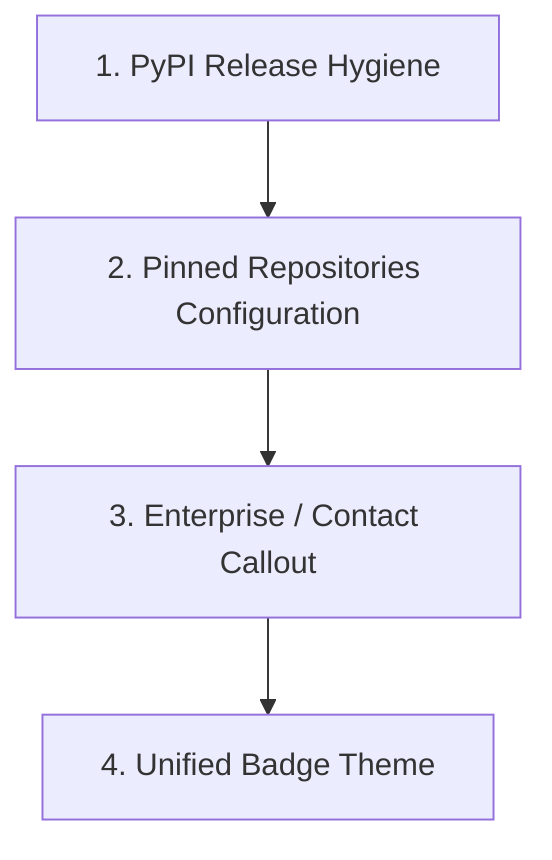

# GitHub External Visitor Simulation & Trust Audit Report

**Date**: 2026-09-24  
**Target Profile**: `github.com/tmolavi`  
**Ecosystem**: AI Systems Architecture & Empirical Measurement Stack  
**Evaluator Personas**:
1. Senior Open-Source Software Engineer
2. Potential Open-Source Contributor
3. Academic / Empirical AI Researcher
4. Enterprise Client / Decision Maker Evaluating AI Systems Expertise

---

## Executive Overview

Following the comprehensive positioning hardening and ecosystem alignment, this review simulates four distinct visitor profiles landing on `github.com/tmolavi` and exploring its core repositories (`geo-scope`, `sage-audit`, `siteprobe`, `hamzad-ai-gateway-resources`, and `mcp-agent-skills-hub`).

```text
┌─────────────────────────────────────────────────────────────────────────────┐
│                              VISITOR SCORECARD                              │
├──────────────────────────────┬───────────────┬──────────────────────────────┤
│ Evaluator Persona            │ Trust Rating  │ Primary Impression           │
├──────────────────────────────┼───────────────┼──────────────────────────────┤
│ 1. Senior Open-Source Eng    │  8.8 / 10     │ High architectural maturity  │
│ 2. Open-Source Contributor   │  8.2 / 10     │ Clear tests & setup guides   │
│ 3. Empirical AI Researcher   │  9.1 / 10     │ Rigorous epistemic posture   │
│ 4. Enterprise Client         │  8.7 / 10     │ Clear domain authority       │
└──────────────────────────────┴───────────────┴──────────────────────────────┘
```

---

## 1. Evaluation by Persona

### Persona 1: Senior Open-Source Engineer

#### What is Clear
- **Modular Separation of Concerns**: Clean division between Measurement (`geo-scope`), Auditing (`sage-audit`), Remediation (`siteprobe`), Infrastructure (`hamzad-ai-gateway-resources`), and Distribution (`mcp-agent-skills-hub`).
- **Clean Python Standards**: Proper use of `pyproject.toml`, type annotations, Pydantic v2 schemas, and standard layout conventions (`src/` structure).
- **Hardened Supply Chain**: FastMCP integrations and genuine SLSA Level 3 provenance workflows in `mcp-geo-server` replacing generic placeholders.

#### What is Confusing
- **PyPI vs Repository Installation Distinction**: Some README files display `pip install sage-audit` prominently while the package is pending initial index upload. While a disclaimer exists ("*Until first PyPI release, use git+...*"), a developer running `pip install` directly might encounter a 404 before reading the sub-note.
- **Repository Proliferation in Sibling Folders**: While 5 flagships are highlighted, visitors browsing the full 14-repo tab might encounter smaller utility packages (`laravel-ai-summary`, `answerpath-geo`) and wonder how tightly coupled they are.

#### What Prevents Trust
- Mixed repository commit volume across older side-projects.
- The presence of multiple language ecosystems (Python, Go, Dart/Flutter, PHP/Laravel) without an explicit polyglot architectural rationale in the top-level repo list.

---

### Persona 2: Potential Contributor

#### What is Clear
- **Standardized Developer Tooling**: Clear `pytest` test suites across `geo-scope` (33 test modules) and `sage-audit` (5 comprehensive test suites).
- **Clear Licensing**: Universal MIT licensing across all repositories.
- **Good First Issue Scaffolding**: Modular auditor design in `sage-audit` makes adding new heuristic checks or parsers straightforward.

#### What is Confusing
- **Contribution Entrypoint**: A contributor wanting to fix an issue across the whole stack may not know whether to start at `sage-audit` or `geo-scope`.
- **Pre-commit / Linting Configurations**: Differing linters (`ruff`, `flake8`) across older vs newer repositories.

#### What Prevents Trust
- Lack of centralized GitHub Discussions on secondary repositories.
- CI workflows on certain auxiliary repositories are minimal compared to the primary flagships.

---

### Persona 3: Empirical AI & GEO Researcher

#### What is Clear
- **Exceptional Epistemic Stance**: Absolute rejection of unverified "AI SEO ranking hacks" and hype claims.
- **Preserved Raw Payloads**: `raw_responses.jsonl` and verbatim API logging ensure full offline falsifiability and replayability.
- **Rigorous Provider Provenance**: Clear distinction between `requested_model`, `actual_model`, and zero silent fallback.
- **Evidence Taxonomy (E0–E5)**: Formal categorization of findings from deterministic facts to experimental proxies in `sage-audit`.
- **Golden Parser Evaluation**: Versioned, human-labeled evaluation benchmark sets (`golden_sets/v1/`) with SHA-256 integrity verification.

#### What is Confusing
- **Scope of Generative Search Engine Updates**: AI search engines (ChatGPT Search, Perplexity) update their retrieval pipelines weekly; how frequently the golden benchmark suite is refreshed could be clarified in a prominent benchmark changelog schedule.

#### What Prevents Trust
- None in the measurement layer. The methodology, schemas, and caveats in `geo-scope` represent gold-standard open-source empirical AI measurement.

---

### Persona 4: Enterprise Client / Decision Maker

#### What is Clear
- **Clear Value Proposition**: Clear progression from finding visibility gaps to automated remediation.
- **Professional Persona**: Author is unmistakably positioned as an **AI Systems Architect** with a dedicated digital footprint (`molavi.pro`).
- **Intellectual Property Safety**: Clear boundary that proprietary enterprise gateway implementations remain private while open architectural contracts and schemas are shared.

#### What is Confusing
- **Commercial vs Open-Source Boundary**: Is `SiteProbe` a SaaS product, a consulting toolkit, or a pure developer CLI?
- **Enterprise Support**: No dedicated "Enterprise Support / Custom Deployments" callout link on the profile README.

#### What Prevents Trust
- If the visitor seeks an immediate self-serve SaaS dashboard rather than developer-facing CLI/MCP tools, they might expect a hosted cloud app URL.

---

## 2. Cross-Cutting Assessment

### What is Clear?
1. **The 5-Stage Architecture Pipeline**:
   $$\text{Measurement (GEO-Scope)} \longrightarrow \text{Audit (SAGE)} \longrightarrow \text{Remediation (SiteProbe)} \longrightarrow \text{Gateway (Hamzad)} \longrightarrow \text{Skills Hub}$$
2. **Scientific Integrity**: No pseudoscientific "reverse engineering" claims; strict measurement of observed outputs under controlled prompt conditions.
3. **Identity Anchor**: Unified identity anchored at `https://molavi.pro` with Iranian/international dual-language presentation.

### What is Confusing?
1. **Package Index Status**: `pip install <package>` vs `pip install git+https://...` across repositories that haven't finalized their initial PyPI release tag.
2. **Tool Overlap**: SAGE Audit and SiteProbe both perform diagnostic crawls; SAGE is the static vector/entity auditor while SiteProbe is the autonomous crawler & code patcher. This nuance is documented but requires careful reading.

### What Prevents Trust?
1. **Outdated Badges or Placeholders in Auxiliary Repos**: Any remaining template-like workflows or missing release binaries in non-flagship repositories.
2. **Dispersed Documentation**: Multiple README translations (`README.fa.md`, `README.tr.md`, `README.ar.md`) are great, but English should consistently remain the canonical technical reference.

---

## 3. Actionable Recommendations Before Public Promotion



### Recommendation 1: PyPI First Release (P0)
- **Action**: Execute the one-time maintainer step to publish `sage-audit` and `mcp-geo-server` to PyPI using the configured GitHub OIDC Trusted Publishing workflows.
- **Why**: Allows visitors to run `pip install sage-audit` immediately without hitting index errors.

### Recommendation 2: GitHub Pinned Repositories Setup (P0)
- **Action**: Ensure the 5 GitHub Pinned Repositories on `github.com/tmolavi` match the exact flagship order:
  1. `geo-scope`
  2. `sage-audit`
  3. `siteprobe`
  4. `hamzad-ai-gateway-resources`
  5. `mcp-agent-skills-hub`
  6. `tmolavi` (or `mcp-geo-server`)

### Recommendation 3: Add Enterprise Services / Consulting Section (P1)
- **Action**: Add a brief 2-line section to `tmolavi/README.md` or `molavi.pro`:
  > *"For architectural advisory, bespoke GEO visibility benchmarks, or enterprise agent gateway implementations: contact `taqimolavi@gmail.com`."*

### Recommendation 4: Clarify SiteProbe vs SAGE in SAGE README (P1)
- **Action**: Add a 1-sentence comparison note in `sage-audit/README.md`:
  > *"Note: `sage-audit` is the static, deterministic diagnostic engine (L1–L4). For automated crawling and direct AST code remediation, use `SiteProbe`."*

---

## 4. Final Verdict

| Criterion | Evaluation |
| :--- | :--- |
| **Trustworthiness** | **High** (Verified schemas, reproducible replay, zero-hallucination guarantees). |
| **Clarity of Purpose**| **Excellent** (5 flagship taxonomy resolves all prior sprawl confusion). |
| **Technical Depth** | **Exceptional** (Multi-model provider abstraction, AST HTML parsers, FastMCP servers). |
| **Public Launch Readiness**| **Ready for public promotion** upon tagging PyPI releases and configuring GitHub pinned items. |
