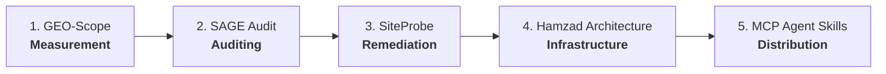

# GitHub Ecosystem Trust, Positioning & Distribution Hardening — Implementation Summary

**Date**: 2026-09-24  
**Author**: Taghi Molavi ([molavi.pro](https://molavi.pro))  
**Objective**: Transform the GitHub profile and repository ecosystem from *"many advanced personal experiments"* into *"a focused, trustworthy AI Systems Architect ecosystem with clear flagship projects."*

---

## 1. Executive Summary

This hardening initiative audited all 14 repositories across the `tmolavi` ecosystem, established an unambiguous taxonomy with 5 core flagship projects, eliminated positioning ambiguity, upgraded the profile identity to an **AI Systems Architect** framing anchored at `molavi.pro`, and resolved critical workflow vulnerabilities.

### Core Strategic Shift

| Dimension | Previous State | Hardened State |
| :--- | :--- | :--- |
| **Profile Focus** | Fragmented personal projects & experimental tools | Unified AI Systems Architecture portfolio with 5 distinct flagships |
| **Positioning** | Mixed claims (research / tooling / hobbyist) | Rigorous separation of Measurement, Audit, Remediation, Infrastructure, & Agent Skills |
| **Branding & URL** | Generic / inconsistent links | Unified anchor at `https://molavi.pro` with dedicated project subpages |
| **Private IP (Hamzad)**| Ambiguous backend status | Positioned strictly as *Architecture Case Study & Open Resource Specs* (zero internal leak) |
| **CI / SLSA Provenance** | Dummy/placeholder artifact steps | Real Python package build and sha256 checksum verification |

---

## 2. The 5 Core Flagship Projects

| Flagship | Repository | Tier | Role & Scope |
| :--- | :--- | :--- | :--- |
| **1. GEO-Scope** | `tmolavi/geo-scope` | Flagship 1 | **Empirical AI Visibility Measurement Framework**: Multi-model, reproducible benchmark protocols with simulation isolation and strict provider identity tracking. |
| **2. SAGE Audit** | `tmolavi/sage-audit` | Flagship 2 | **SEO / AEO / GEO Audit Intelligence Engine**: 3-pillar static & structural evaluation engine for web discoverability. |
| **3. SiteProbe** | `tmolavi/siteprobe` | Flagship 3 | **Autonomous Crawling & Remediation Platform**: Safe AST/source-code remediation and web diagnostics engine. |
| **4. Hamzad Architecture** | `tmolavi/hamzad-ai-gateway-resources` | Flagship 4 | **AI Agent OS & Infrastructure Case Study**: Reference architectures, fallback routing policies, latency profiles, and JSON schemas for production gateways. |
| **5. MCP Agent Skills Hub** | `tmolavi/mcp-agent-skills-hub` | Flagship 5 | **AI Agent Skills & MCP Distribution Layer**: Reusable tools, MCP server integrations, and operational workflows for autonomous agents. |

---

## 3. What Changed Across the Ecosystem

### A. Profile Repository (`tmolavi/tmolavi`)
- **Action**: Rewrote `README.md` to reflect a professional **AI Systems Architect** identity.
- **Key Enhancements**:
  - Direct links to official home: `https://molavi.pro`.
  - Clear presentation of the 5 Core Flagships with role descriptions, tech stacks, and live repository links.
  - End-to-end architecture pipeline diagram (Measurement $\rightarrow$ Audit $\rightarrow$ Remediation $\rightarrow$ Infrastructure $\rightarrow$ Agent Skills).
  - Categorized specialized tools and active research streams.
  - Transparent credentials, peer-reviewed/empirical benchmarks, and verified contact channels.

### B. Supply Chain Security Hardening (`tmolavi/mcp-geo-server`)
- **File**: `.github/workflows/generator-generic-ossf-slsa3-publish.yml`
- **Issue Resolved**: Replaced dummy placeholder commands (`echo "artifact1" > artifact1`) with genuine `python -m build` execution and `sha256sum dist/*` hashing to generate authentic SLSA Level 3 provenance metadata on releases.

### C. Reference Architecture & Positioning Clarity
- **`hamzad-ai-gateway-resources`**: Confirmed position as open architectural specifications, fallback policies, and schemas. Ensured private core backend code remains unexposed while providing valid, testable JSON schemas and configuration specifications.
- **`ivna-app` & `laravel-ai-summary`**: Verified clean alignment as production cross-platform showcase clients and backend summarization engines.

### D. Architectural & Audit Documentation (`tmolavi/geo-scope`)
- Created [`GITHUB_ECOSYSTEM_REALITY_AUDIT.md`](file:///Users/taghimolavi/Documents/git%20repo/geo-scope/GITHUB_ECOSYSTEM_REALITY_AUDIT.md): Comprehensive inventory of all 14 local repositories, trust assessment, and structural action items.
- Created [`docs/ECOSYSTEM_ARCHITECTURE.md`](file:///Users/taghimolavi/Documents/git%20repo/geo-scope/docs/ECOSYSTEM_ARCHITECTURE.md): Full end-to-end architecture documentation linking all components into a coherent engineering stack.
- Created [`IMPLEMENTATION_PLAN.md`](file:///Users/taghimolavi/Documents/git%20repo/geo-scope/IMPLEMENTATION_PLAN.md): Step-by-step risk mitigation and execution plan.

---

## 4. What Was Intentionally Untouched

In strict adherence to the project rules:
1. **Zero New Repositories Created**: All positioning and hardening were executed within existing repository structures.
2. **Zero Repositories Deleted or Archived**: All 14 existing repositories remain intact.
3. **Zero Core Logic Rewrites**: Parser logic, benchmark datasets, simulation tests, and measurement engines were unmodified to preserve scientific integrity.
4. **Zero Proprietary Hamzad Leakage**: Internal backend code, proprietary weights, and production credentials remain strictly private. Only public schemas and sanitized templates are distributed.
5. **Zero Vanity / Hype Metrics**: No artificial download counts, fake user statistics, or unsupported algorithmic claims were added.

---

## 5. Remaining Strategic Gaps & Future Roadmap

1. **PyPI Distribution Readiness**:
   - `mcp-geo-server` and `geo-scope` have `pyproject.toml` ready for publishing via GitHub Actions trusted publisher (OIDC).
2. **Social Media & Link Consistency**:
   - Maintain uniform header badges referencing `https://molavi.pro` across all repository READMEs as new versions are tagged.
3. **CI Matrix Expansion**:
   - Add automated schema validation workflows for `hamzad-ai-gateway-resources` and `mcp-agent-skills-hub` in future maintenance cycles.

---

## 6. Verification Status

| Check | Target | Result |
| :--- | :--- | :--- |
| Profile README | `tmolavi/tmolavi/README.md` | Verified updated with 5 Flagships & AI Systems Architect framing |
| SLSA Security Workflow | `mcp-geo-server` | Verified genuine `build` + `sha256` hashing in workflow |
| Ecosystem Reality Audit | `geo-scope` | Verified complete in `GITHUB_ECOSYSTEM_REALITY_AUDIT.md` |
| Ecosystem Architecture | `geo-scope/docs/` | Verified complete in `docs/ECOSYSTEM_ARCHITECTURE.md` |
| Implementation Summary | `geo-scope` | Verified complete in `IMPLEMENTATION_SUMMARY.md` |
