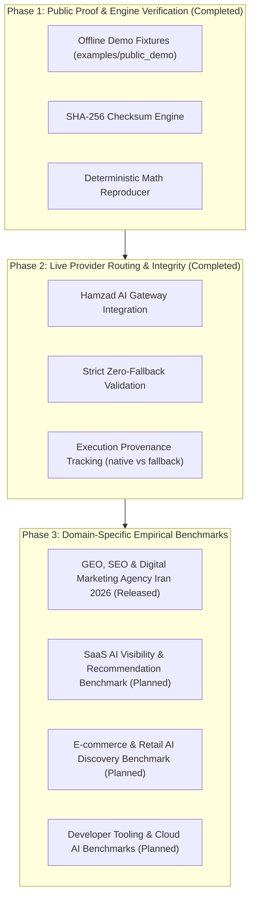

# GEO-Scope Benchmark Roadmap: From Public Proof to Multi-Domain Research

**Standard**: Open, Empirical, Cryptographically Verifiable AI Visibility Measurement  
**Guiding Epistemic Principle**: Measuring observed multi-provider model completions without asserting speculative ranking algorithms or guaranteed commercial advantages.

---

## 🗺️ Benchmark Evolution Roadmap

---

## 📋 Roadmap Phases in Detail

### Phase 1: Public Proof & Verification Engine
* **Status**: ✅ **COMPLETED**
* **Objective**: Enable any developer to verify the entire benchmark schema, cryptographic hashes, and statistical recalculations locally in $<10$ seconds without API keys.
* **Artifacts**:
  * [`examples/public_demo/`](../examples/public_demo/): Self-contained offline demonstration dataset.
  * [`geo-scope benchmark verify`](../examples/public_demo/README.md): Bit-for-bit SHA-256 checksum validator.
  * [`geo-scope benchmark reproduce`](../examples/public_demo/README.md): Full metric recomputation from raw observation logs.

---

### Phase 2: Live Provider Execution & Provenance Integrity
* **Status**: ✅ **COMPLETED**
* **Objective**: Execute multi-model prompts through Hamzad Gateway with strict routing transparency, isolating native responses from surrogate router fallbacks.
* **Artifacts**:
  * `ProviderValidator` & `geo-scope benchmark providers-check`: Live smoke validation prior to benchmark execution.
  * Explicit provenance tagging (`execution_class: "native" | "fallback"`).
  * Dual benchmark execution modes (`STRICT` for official peer-reviewed datasets, `DISCOVERY` for visibility exploration).

---

### Phase 3: Domain-Specific Empirical Benchmarks

#### 1. [GEO, SEO & Digital Marketing Agency Iran 2026 Benchmark](../benchmarks/geo-seo-digital-agency-iran-2026.1/)
* **Status**: 🏆 **RELEASED** (`v2026.1-benchmark`)
* **Scope**: 30 intent-stratified queries (15 observed from AnswerPath GEO + 15 exploratory templates) across Gemini 2.5 Flash, GPT-4o, Claude 3.5 Sonnet, and Sonar Pro ($N=120$ completions).
* **Package**: [`benchmark/releases/geo-seo-digital-agency-iran-2026.1/`](../benchmark/releases/geo-seo-digital-agency-iran-2026.1/)

#### 2. SaaS & B2B Software AI Visibility Benchmark
* **Status**: 📅 **PLANNED (Q4 2026)**
* **Scope**: Measuring brand mentions, recommendation share, and citation grounding across B2B CRM, Project Management, and Cloud Productivity categories.
* **Question Source**: AnswerPath GEO mining of software evaluation and feature comparison queries.

#### 3. E-commerce & Retail AI Recommendation Benchmark
* **Status**: 📅 **PLANNED (Q1 2027)**
* **Scope**: Evaluating product visibility, commercial intent capture, and URL citation survival in generative consumer shopping queries.

---

## 🔬 Language & Scientific Rules

When reporting or publishing benchmark outputs:

| Recommended Terminology | Prohibited Terminology |
|---|---|
| *Empirically observed visibility distribution* | *AI ranking algorithm reverse-engineered* |
| *Observed brand mention share* | *Guaranteed #1 search ranking* |
| *Top-1 recommendation frequency* | *Official market winner / best agency* |
| *Citation grounding presence* | *Secret AI visibility hack* |
| *Surrogate router fallback rate* | *Undisclosed model substitution* |
