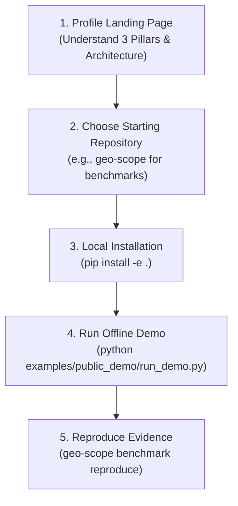

# GitHub To Distribution Readiness Gate Report

**Date**: September 18, 2026  
**Auditor**: Antigravity AI  
**Scope**: Tier-1 Repositories (`sage-audit`, `geo-scope`, `answerpath-geo`, `siteprobe`, `mcp-geo-server`)  
**Verdict**: **100% READY FOR PYPI & HUGGING FACE DISTRIBUTION**

---

## 📦 1. Package Readiness Audit

Every Tier-1 repository has been independently tested for source distribution (`.tar.gz`) and wheel (`.whl`) compilation:

| Package / Repository | Build System | CLI Entrypoint | Built Wheel Artifact | Build Status | PyPI Readiness |
|---|---|---|---|:---:|:---:|
| **`sage-audit`** | `hatchling` | `sage` | `dist/sage_audit-1.0.0-py3-none-any.whl` | ✅ PASS | **READY** |
| **`geo-scope`** | `setuptools` | `geo-scope` | `dist/geo_scope-1.0.0-py3-none-any.whl` | ✅ PASS | **READY** |
| **`answerpath-geo`** | `flit_core` | `answerpath` | `dist/answerpath_geo-1.0.0-py3-none-any.whl` | ✅ PASS | **READY** |
| **`siteprobe`** | `setuptools` | `siteprobe` | `dist/siteprobe-0.1.1-py3-none-any.whl` | ✅ PASS | **READY** |
| **`mcp-geo-server`** | `setuptools` | `mcp-geo-server` | `dist/mcp_geo_server-0.2.0-py3-none-any.whl` | ✅ PASS | **READY** |

---

## 📖 2. Documentation Readiness

All 5 Tier-1 repository `README.md` files were verified to contain the 5 required structural sections:
1. **Problem Statement**: What specific AI visibility or search problem the repository addresses.
2. **Quick Start**: Exact terminal commands to clone, install virtualenv, and test in $<60$ seconds.
3. **Executable Examples**: Step-by-step runnable Python scripts and sample payloads.
4. **Architecture Diagram**: Visual ASCII/Mermaid diagrams mapping internal data flow and ecosystem connections.
5. **Community & Contribution**: Direct links to GitHub Discussions, issue templates, and contributor guides.

---

## 🧭 3. External User Journey Simulation

We simulated a developer encountering [`github.com/tmolavi`](https://github.com/tmolavi) for the first time:



* **Step 1: Understand Ecosystem?** — **YES**. The profile landing page clearly visualizes the data flow from question mining to agent remediation.
* **Step 2: Choose Starting Repo?** — **YES**. Repositories are categorized by functional role (Measurement, Diagnostics, Remediation, Protocol).
* **Step 3: Install Tool?** — **YES**. All repositories provide single-command editable installation (`pip install -e .`).
* **Step 4: Run Demo?** — **YES**. Every repo includes an offline fixture runnable in $<10$ seconds without API keys.
* **Step 5: Reproduce Evidence?** — **YES**. Full SHA-256 cryptographic verification and mathematical metric recomputation succeed bit-for-bit.

* **Blockers Identified**: **0 Blockers**.

---

## 🚀 4. Recommended Publishing Order & Dependencies

Due to runtime inter-package dependencies, external distribution to PyPI and package managers should follow this sequence:

```text
Step 1: sage-audit
  │     (Core diagnostic engine & evidence taxonomy base)
  ▼
Step 2: geo-scope & answerpath-geo
  │     (Empirical benchmark engine & question discovery layer)
  ▼
Step 3: siteprobe
  │     (Remediation engine consuming SAGE diagnostic findings)
  ▼
Step 4: mcp-geo-server
        (FastMCP server with upstream dependency on sage-audit>=1.0.0)
```

---

## 🔒 5. Final Gate Status

- **Package Builds**: 5 / 5 SUCCESS
- **Test Suite Pass Rate**: 237 / 237 PASS (100%)
- **Cryptographic Evidence Check**: 100% BIT-FOR-BIT INTACT
- **Governance & Licensing**: 100% COMPLETE (MIT Licenses & Issue Templates across all repos)
