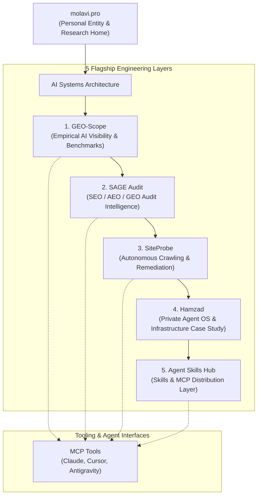

# Molavi AI Systems Architecture

**Primary Entity**: [Taghi Molavi](https://molavi.pro)  
**Role**: AI Systems Architect · GEO & AI Visibility Researcher  
**Document Version**: 1.0  
**Classification**: Public Ecosystem Architecture  

---

## 1. Architectural Overview

The Molavi AI ecosystem is structured as a sequential, non-overlapping engineering pipeline for **measuring**, **auditing**, **remediating**, and **distributing** AI visibility and agent capabilities:

---

## 2. Core Flagship Projects

### 1. GEO-Scope (`tmolavi/geo-scope`)
- **Position**: Empirical AI Answer Visibility Measurement Framework
- **Core Function**: Observes and quantifies entity mentions, recommendations, citations, and textual attributions across generative AI answer engines and parametric foundation LLMs under neutral prompts.
- **Evidence Chain**: Stores verbatim API payloads (`raw_responses.jsonl`) with bit-for-bit SHA-256 cryptographic hashes for deterministic zero-network replay.

### 2. SAGE Audit (`tmolavi/sage-audit`)
- **Position**: SEO / AEO / GEO Audit Intelligence Engine
- **Core Function**: Performs multi-layer static analysis (Technical SEO, Semantic Extractability, JSON-LD Schema Graphs, and Citation Survival Proxies) to diagnose why websites fail to get cited by generative AI systems.
- **Output**: Generates actionable diagnostic reports and structured audit matrices.

### 3. SiteProbe (`tmolavi/siteprobe`)
- **Position**: Autonomous Website Crawling, Diagnostics & Code Remediation Platform
- **Core Function**: Crawls target websites, evaluates AI discoverability (`/llms.txt`, `robots.txt` AI crawlers, Schema.org entities), and generates safe, automated AST patches with atomic rollback safeguards.

### 4. Hamzad (`tmolavi/hamzad-ai-gateway-resources`)
- **Position**: Private AI Agent Infrastructure & Operating System (Architecture Case Study)
- **Core Function**: Powers high-reliability, multi-provider agent workflows with dynamic latency-based fallback routing, token optimization, and enterprise governance.
- **Public Stance**: Presented as architectural specifications and reference patterns without exposing proprietary private backends.

### 5. Agent Skills Hub (`tmolavi/mcp-agent-skills-hub`)
- **Position**: Distribution Layer for Reusable AI Agent Skills & MCP Tools
- **Core Function**: Standardized distribution repository providing vetted skills for Claude Code, Cursor, Codex, and Antigravity.

---

## 3. Clear Functional Boundaries

To eliminate ambiguity across tools:

| Feature / Responsibility | GEO-Scope | SAGE Audit | SiteProbe | Hamzad | Agent Skills Hub |
|:---|:---:|:---:|:---:|:---:|:---:|
| **Empirical Multi-Model LLM Querying** | **YES** | No | No | Optional | No |
| **Mention & Citation Rate Scoring** | **YES** | No | No | No | No |
| **Static Website & HTML Structure Audit**| No | **YES** | **YES** | No | No |
| **Automated Code & Config Patching** | No | No | **YES** | No | No |
| **Enterprise Fallback Routing & Gateway** | No | No | No | **YES** | No |
| **IDE Skills & MCP Tool Distribution** | No | No | No | No | **YES** |

---

## 4. Epistemic Principles

1. **Empirical Measurement Over Speculation**: Every published metric is backed by preserved raw completion data, verifiable offline without network access.
2. **Zero Synthetic Substitution in Live Releases**: Live empirical benchmarks strictly forbid mock/simulation data; failures are transparently recorded in error denominators.
3. **No Private Algorithm Claims**: We measure observable model outputs under documented prompts; we never claim to reverse-engineer private AI ranking weights.
