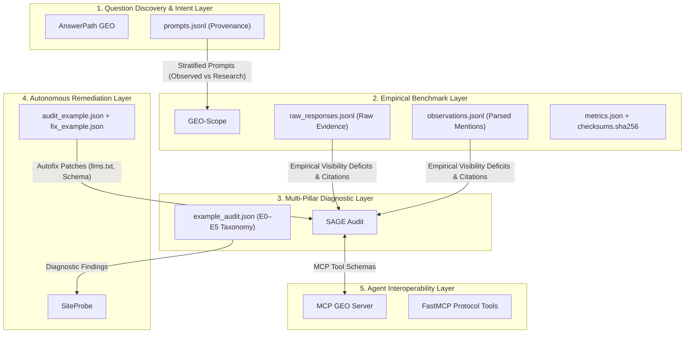

# Cross-Repository Evidence Map: Molavi AI Visibility & Agent Stack

This document charts the end-to-end evidence chain across the repositories in the **Molavi AI Visibility Stack**, showing how verified artifacts flow from question discovery through empirical measurement to diagnostic auditing and agent remediation without simulated fallback or epistemic blurring.

---

## 🏛️ Component Evidence Matrix

| Component | Implementation | Evidence Artifact |
|:---|:---|:---|
| **AnswerPath GEO** | Question discovery, intent classification, and provenance separation | `prompts.jsonl` (with `source_category: observed_user_questions \| research_questions`) |
| **GEO-Scope** | Measurement engine, entity parser, replay engine & statistical metrics | `observations.jsonl`, `citations.jsonl`, `metrics.json`, `checksums.sha256` |
| **Gateway / Provider Layer** | Multi-provider execution with zero silent fallback | `raw_responses.jsonl`, `manifest.json` (`provider_classes`), `errors.jsonl` |
| **Entity Registry & Parser** | Multi-type entity definitions with negative homonym filters | `entities.json` + `observations.jsonl` (`confused_with`, `person_mentioned`) |
| **Citation Attribution Engine** | Domain extraction & citation graph construction | `citations.jsonl` + Answer Engine citation metrics |
| **SAGE Audit** | 3-Pillar diagnostic auditor (SEO + AEO + GEO) with E0–E5 taxonomy | Diagnostic audit payloads, CSP calculation logs |
| **SiteProbe** | Closed-loop crawler & deterministic autofixer | Crawl delta logs, `llms.txt` patches, Schema JSON-LD fixes |
| **MCP GEO Server** | FastMCP JSON-RPC 2.0 stdio/HTTP server for AI coding agents | Standardized MCP tool schema definitions & tool call traces |

---

## 🔗 Evidence Lineage Across Layers

### 1. AnswerPath GEO (`answerpath-geo`)
* **Implementation**: Question discovery and provenance categorization.
* **Evidence Artifact**: [`examples/sample_queries.json`](https://github.com/tmolavi/answerpath-geo/blob/main/examples/sample_queries.json), [`prompts.jsonl`](https://github.com/tmolavi/geo-scope/blob/main/benchmark/releases/global-ai-answers-2026.2/prompts.jsonl).
* **Role**: Preserves explicit tagging for observed user questions versus exploratory research templates.

---

### 2. GEO-Scope (`geo-scope`)
* **Implementation**: Multi-model measurement engine and offline replay.
* **Evidence Artifact**: 
  * `benchmark/releases/global-ai-answers-2026.2/`: 500 prompts, 626 raw responses, 45,698 observations.
  * `benchmark/releases/global-ai-answers-2026.2-pilot/`: 100 prompts, 298 raw responses, 8,940 observations.
  * `benchmark/releases/global-ai-answers-2026.1/`: 34 prompts, 24 entities.
  * `benchmark/releases/geo-seo-digital-agency-iran-2026.1/`: 30 prompts, 120 completions.
* **Role**: Captures raw model outputs verbatim and computes descriptive visibility metrics with bootstrap confidence intervals.

---

### 3. SAGE Audit (`sage-audit`)
* **Implementation**: Multi-pillar diagnostic engine (Technical SEO + Entity AEO + Generative GEO).
* **Evidence Artifact**: `examples/example_audit.json` mapping technical findings to the E0–E5 epistemic taxonomy.
* **Role**: Converts empirical visibility gaps into classified diagnostic findings.

---

### 4. SiteProbe (`siteprobe`)
* **Implementation**: Autonomous website crawler and safe code patch generator.
* **Evidence Artifact**: `examples/audit_example.json`, `examples/fix_example.json`.
* **Role**: Generates verifiable website patches (`llms.txt`, JSON-LD schema, crawler allowances).

---

### 5. MCP GEO Server (`mcp-geo-server`)
* **Implementation**: Model Context Protocol interface exposing measurement and diagnostic tools to AI agents.
* **Evidence Artifact**: `examples/mcp_client_example.py`, `geo_scope/mcp_server.py`.
* **Role**: Provides programmatic tool execution for AI agent workflows.

---

## 🛡️ Epistemic Rules

1. **No Synthetic Cross-Contamination**: Question demand (`answerpath-geo`) and benchmark observations (`geo-scope`) are never synthesized or fabricated for published benchmark packages.
2. **Zero Silent Fallback**: Execution failures in live measurements are never masked with simulation fixtures.
3. **Traceable Provenance**: Every metric in `geo-scope` points directly to verifiable lines in `raw_responses.jsonl`, `observations.jsonl`, and `prompts.jsonl`.
4. **Deterministic Reproducibility**: All calculations in the evidence chain can be recomputed from raw logs offline using `geo-scope benchmark replay`.
