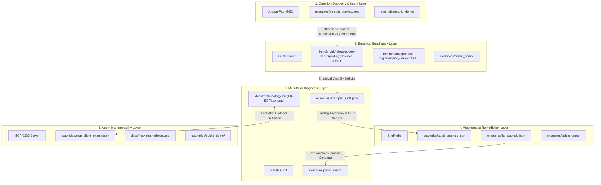

# Cross-Repository Evidence Map: Molavi AI Visibility & Agent Stack

This document charts the end-to-end evidence chain across the 5 Tier-1 repositories in the **Molavi AI Visibility Stack**, showing how verified artifacts flow from question discovery to agent remediation without data corruption or epistemic blurring.

---

## 🔗 Evidence Lineage & Artifact Details

### 1. AnswerPath GEO (`answerpath-geo`)
* **Role**: Owns search query mining, conversational question extraction, and intent classification.
* **Evidence Artifacts**:
  * [`examples/sample_queries.json`](https://github.com/tmolavi/answerpath-geo/blob/main/examples/sample_queries.json): Observed query database categorized into 5 intent strata (`commercial`, `compare`, `trust`, `solve`, `buy`).
  * [`examples/public_demo/`](https://github.com/tmolavi/answerpath-geo/tree/main/examples/public_demo): Standalone offline discovery demonstration script (`run_demo.py`) with structured provenance metadata.
* **Output to Next Layer**: 30 standardized prompts partitioned into observed user demand ($N=15$) and systematic exploration templates ($N=15$).

---

### 2. GEO-Scope (`geo-scope`)
* **Role**: Owns empirical multi-model benchmark execution, response capture, entity mention extraction, citation parsing, and bootstrap statistical estimation.
* **Evidence Artifacts**:
  * [`benchmark/releases/geo-seo-digital-agency-iran-2026.1/`](https://github.com/tmolavi/geo-scope/tree/main/benchmark/releases/geo-seo-digital-agency-iran-2026.1): Official agency release containing 120 raw model observations (`observations.jsonl`), 30 prompts (`prompts.jsonl`), calculated metrics (`metrics.json`), and cryptographic hashes (`checksums.sha256`).
  * [`benchmark/releases/global-ai-answers-2026.1/`](https://github.com/tmolavi/geo-scope/tree/main/benchmark/releases/global-ai-answers-2026.1): Global human concerns benchmark v1 covering 34 prompts across 7 regions and 9 languages.
  * [`benchmark/releases/global-ai-answers-2026.2-pilot/`](https://github.com/tmolavi/geo-scope/tree/main/benchmark/releases/global-ai-answers-2026.2-pilot): Global AI Answers 2026.2 Pilot release covering 100 prompts across 10 countries and 8 languages with 30 multi-type entities.
  * [`benchmarks/geo-seo-digital-agency-iran-2026.1/`](https://github.com/tmolavi/geo-scope/tree/main/benchmarks/geo-seo-digital-agency-iran-2026.1): Benchmark documentation hub with full research report and methodology.
  * [`examples/public_demo/`](https://github.com/tmolavi/geo-scope/tree/main/examples/public_demo): Offline reproduction package runnable via `geo-scope benchmark reproduce`.
* **Output to Next Layer**: Empirical visibility gaps, brand mention rates, and citation deficits fed into diagnostic auditing.

---

### 3. SAGE Audit (`sage-audit`)
* **Role**: Owns multi-pillar diagnostic auditing across Technical SEO, Entity AEO (JSON-LD Knowledge Graphs), and Generative GEO (Citation Survival Proxy).
* **Evidence Artifacts**:
  * [`examples/example_audit.json`](https://github.com/tmolavi/sage-audit/blob/main/examples/example_audit.json): Full diagnostic payload mapping findings to the Epistemic Evidence Taxonomy (E0–E5).
  * [`docs/methodology.md`](https://github.com/tmolavi/sage-audit/blob/main/docs/methodology.md): Formal mathematical specification for SAGE fusion weights ($0.30 \times \text{SEO} + 0.35 \times \text{AEO} + 0.35 \times \text{GEO}$) and CSP formulation.
  * [`examples/public_demo/`](https://github.com/tmolavi/sage-audit/tree/main/examples/public_demo): Local HTML fixture auditor validating 3-pillar scoring.
* **Output to Next Layer**: Prioritized, classified technical deficiencies passed to autonomous remediation.

---

### 4. SiteProbe (`siteprobe`)
* **Role**: Owns autonomous website crawling, deficiency detection, deterministic patch generation, and post-fix verification.
* **Evidence Artifacts**:
  * [`examples/audit_example.json`](https://github.com/tmolavi/siteprobe/blob/main/examples/audit_example.json): Discovered issues categorized by risk level.
  * [`examples/fix_example.json`](https://github.com/tmolavi/siteprobe/blob/main/examples/fix_example.json): Generated deterministic autofixes (e.g., `llms.txt` generation, JSON-LD Schema injection, `robots.txt` crawler allowances).
  * [`examples/public_demo/`](https://github.com/tmolavi/siteprobe/tree/main/examples/public_demo): Verified delta report demonstrating +22.7 score improvement.
* **Output to Next Layer**: Validated patches and crawl results exposed via MCP tools.

---

### 5. MCP GEO Server (`mcp-geo-server`)
* **Role**: Owns Model Context Protocol (MCP) JSON-RPC 2.0 tool definitions exposing the entire stack to AI coding agents (Claude Code, Cursor, Antigravity).
* **Evidence Artifacts**:
  * [`examples/mcp_client_example.py`](https://github.com/tmolavi/mcp-geo-server/blob/main/examples/mcp_client_example.py): Client script demonstrating programmatic MCP tool invocations.
  * [`docs/mavi-methodology.md`](https://github.com/tmolavi/mcp-geo-server/blob/main/docs/mavi-methodology.md): Specification for the 5-Layer Molavi AI Visibility Index (`MAVI = L1–L4 [SAGE] + L5 [GEO-Scope]`).
  * [`examples/public_demo/`](https://github.com/tmolavi/mcp-geo-server/tree/main/examples/public_demo): Verified MCP JSON-RPC 2.0 request/response fixture.

---

## 🛡️ Epistemic Rules

1. **No Synthetic Cross-Contamination**: Question demand (`answerpath-geo`) and benchmark observations (`geo-scope`) are never synthesized or fabricated.
2. **Traceable Provenance**: Every metric in `geo-scope` points to exact line records in `observations.jsonl` and `prompts.jsonl`.
3. **Reproducibility**: All calculations in the evidence chain can be recomputed from raw logs in $<60$ seconds.
