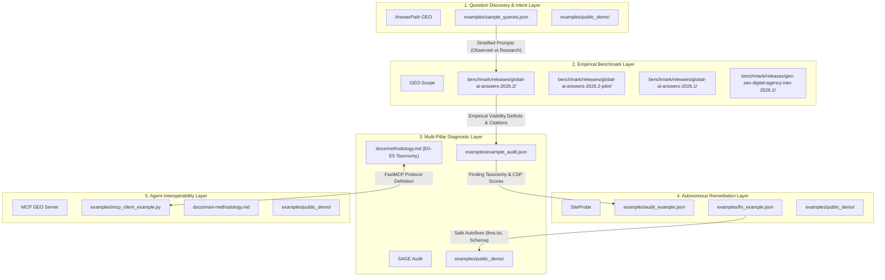

# Cross-Repository Evidence Map: Molavi AI Visibility & Agent Stack

This document charts the end-to-end evidence chain across the 5 Tier-1 repositories in the **Molavi AI Visibility Stack**, demonstrating how verified artifacts flow from question discovery through empirical measurement to diagnostic auditing and agent remediation without data corruption, simulated fallback, or epistemic blurring.

---

## 🏛️ Ecosystem Component & Evidence Matrix

The table below maps each repository component from underlying implementation to raw empirical evidence and verifiable public artifacts:

| Repository Component | Core Implementation | Underlying Evidence | Public Release Artifact |
|:---|:---|:---|:---|
| **AnswerPath GEO** | Question discovery engine, semantic clustering & intent classification | Mined search queries, community forum threads, user question logs | `prompts.jsonl` provenance (`source_category: observed_user_questions` vs `research_questions`) |
| **GEO-Scope** | Multi-model measurement orchestrator, replay engine & statistical estimator | Live API completions, token latencies, parser execution records | `raw_responses.jsonl` + `observations.jsonl` + `metrics.json` + `checksums.sha256` |
| **Hamzad AI Gateway** | Private multi-provider model routing & zero-fallback execution layer | Upstream API HTTP headers, request logs, timestamped error traces | `manifest.json` (`provider_classes`) + `errors.jsonl` |
| **Multi-Type Entity Parser** | Contextual name matching, disambiguation, negative homonym filter | RegEx patterns, canonical domain links, `do_not_confuse` collision rules | `entities.json` + `observations.jsonl` (`confused_with`, `person_mentioned`) |
| **Citation Attribution Engine** | Domain extraction, URL normalization & citation graph builder | Grounding metadata payloads from search-enabled answer engines | `citations.jsonl` + Answer Engine citation density metrics |
| **SAGE Audit** | 3-Pillar diagnostic auditor (SEO + AEO + GEO) with E0–E5 taxonomy | Computed CSP scores, JSON-LD Schema AST graphs, crawl logs | `example_audit.json` + diagnostic audit findings |
| **SiteProbe** | Closed-loop crawler & deterministic code autofixer | AST patch diffs, post-fix validation crawlers, verification deltas | `audit_example.json` + `fix_example.json` (`llms.txt`, JSON-LD) |
| **MCP GEO Server** | FastMCP JSON-RPC 2.0 stdio/HTTP server for AI coding agents | Standardized MCP tool schema definitions & tool call traces | `mcp_client_example.py` + `geo_scope/mcp_server.py` |

---

## 🔗 Evidence Lineage & Artifact Details

### 1. AnswerPath GEO (`answerpath-geo`)
* **Role**: Owns search query mining, conversational question extraction, and intent classification.
* **Evidence Artifacts**:
  * [`examples/sample_queries.json`](https://github.com/tmolavi/answerpath-geo/blob/main/examples/sample_queries.json): Observed query database categorized into 5 intent strata (`commercial`, `comparative`, `problem_solving`, `long_tail`, `reputation`).
  * [`examples/public_demo/`](https://github.com/tmolavi/answerpath-geo/tree/main/examples/public_demo): Standalone offline discovery demonstration script (`run_demo.py`) with structured provenance metadata.
* **Output to Next Layer**: Standardized prompts partitioned into observed user demand ($60\%$) and systematic research templates ($40\%$) with intent tagging.

---

### 2. GEO-Scope (`geo-scope`)
* **Role**: Owns empirical multi-model benchmark execution, response capture, entity mention extraction, citation parsing, and deterministic offline replay.
* **Evidence Artifacts**:
  * [`benchmark/releases/global-ai-answers-2026.2/`](https://github.com/tmolavi/geo-scope/tree/main/benchmark/releases/global-ai-answers-2026.2): Full global research benchmark containing 500 prompts across 50 countries, 22+ languages, 73 entities, 626 raw model completions, and 45,698 observations.
  * [`benchmark/releases/global-ai-answers-2026.2-pilot/`](https://github.com/tmolavi/geo-scope/tree/main/benchmark/releases/global-ai-answers-2026.2-pilot): Controlled pilot release covering 100 prompts across 10 countries and 8 languages.
  * [`benchmark/releases/global-ai-answers-2026.1/`](https://github.com/tmolavi/geo-scope/tree/main/benchmark/releases/global-ai-answers-2026.1): Global human concerns benchmark v1 covering 34 prompts across 7 regions and 9 languages.
  * [`benchmark/releases/geo-seo-digital-agency-iran-2026.1/`](https://github.com/tmolavi/geo-scope/tree/main/benchmark/releases/geo-seo-digital-agency-iran-2026.1): Official agency release containing 120 raw model observations, 30 prompts, and bootstrap confidence intervals.
  * [`examples/public_demo/`](https://github.com/tmolavi/geo-scope/tree/main/examples/public_demo): Offline reproduction package runnable via `geo-scope benchmark reproduce`.
* **Output to Next Layer**: Empirical visibility gaps, brand mention rates, and citation deficits fed into diagnostic auditing.

---

### 3. SAGE Audit (`sage-audit`)
* **Role**: Owns multi-pillar diagnostic auditing across Technical SEO, Entity AEO (JSON-LD Knowledge Graphs), and Generative GEO (Citation Survival Proxy).
* **Evidence Artifacts**:
  * [`examples/example_audit.json`](https://github.com/tmolavi/sage-audit/blob/main/examples/example_audit.json): Full diagnostic payload mapping findings to the Epistemic Evidence Taxonomy (E0–E5).
  * [`docs/methodology.md`](https://github.com/tmolavi/sage-audit/blob/main/docs/methodology.md): Formal mathematical specification for SAGE fusion weights and CSP formulation.
  * [`examples/public_demo/`](https://github.com/tmolavi/sage-audit/tree/main/examples/public_demo): Local HTML fixture auditor validating 3-pillar scoring.
* **Output to Next Layer**: Prioritized, classified technical deficiencies passed to autonomous remediation.

---

### 4. SiteProbe (`siteprobe`)
* **Role**: Owns autonomous website crawling, deficiency detection, deterministic patch generation, and post-fix verification.
* **Evidence Artifacts**:
  * [`examples/audit_example.json`](https://github.com/tmolavi/siteprobe/blob/main/examples/audit_example.json): Discovered issues categorized by risk level.
  * [`examples/fix_example.json`](https://github.com/tmolavi/siteprobe/blob/main/examples/fix_example.json): Generated deterministic autofixes (e.g., `llms.txt` generation, JSON-LD Schema injection, `robots.txt` crawler allowances).
  * [`examples/public_demo/`](https://github.com/tmolavi/siteprobe/tree/main/examples/public_demo): Verified delta report demonstrating score improvements.
* **Output to Next Layer**: Validated patches and crawl results exposed via MCP tools.

---

### 5. MCP GEO Server (`mcp-geo-server`)
* **Role**: Owns Model Context Protocol (MCP) JSON-RPC 2.0 tool definitions exposing the entire stack to AI coding agents (Claude Code, Cursor, Antigravity).
* **Evidence Artifacts**:
  * [`examples/mcp_client_example.py`](https://github.com/tmolavi/mcp-geo-server/blob/main/examples/mcp_client_example.py): Client script demonstrating programmatic MCP tool invocations.
  * [`docs/mavi-methodology.md`](https://github.com/tmolavi/mcp-geo-server/blob/main/docs/mavi-methodology.md): Specification for the 5-Layer Molavi AI Visibility Index (`MAVI = L1–L4 [SAGE] + L5 [GEO-Scope]`).
  * [`examples/public_demo/`](https://github.com/tmolavi/mcp-geo-server/tree/main/examples/public_demo): Verified MCP JSON-RPC 2.0 request/response fixture.

---

## 🛡️ Epistemic Rules

1. **No Synthetic Cross-Contamination**: Question demand (`answerpath-geo`) and benchmark observations (`geo-scope`) are never synthesized or fabricated for published benchmark packages.
2. **Zero Silent Fallback**: Execution failures in live measurements are never masked with simulation fixtures.
3. **Traceable Provenance**: Every metric in `geo-scope` points directly to verifiable lines in `raw_responses.jsonl`, `observations.jsonl`, and `prompts.jsonl`.
4. **Deterministic Reproducibility**: All calculations in the evidence chain can be recomputed from raw logs offline using `geo-scope benchmark replay`.
