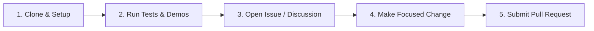

# First Contribution Guide: Getting Started with GEO-Scope & AI Visibility Stack

Welcome! Whether you are an open-source developer, an AI engineer, or an empirical researcher, we welcome contributions that improve code quality, documentation, test coverage, and benchmark methodology.

---

## ⚡ 5-Step Contributor Journey



### Step 1: Clone the Repository & Setup Environment
```bash
git clone https://github.com/tmolavi/geo-scope.git
cd geo-scope

# Create and activate Python virtual environment
python3 -m venv .venv
source .venv/bin/activate

# Install dependencies in editable mode
pip install -e ".[dev]"
```

### Step 2: Verify Your Local Setup & Run Public Demo
Run the test suite and verify the bundled offline demonstration dataset:
```bash
# Run test suite
pytest tests/ -v

# Verify and reproduce the public demo dataset
geo-scope benchmark reproduce --dataset examples/public_demo
```

### Step 3: Open an Issue or Join a Discussion
Before embarking on substantial new features or large refactors:
- Browse open discussions on [GitHub Discussions](https://github.com/tmolavi/geo-scope/discussions) under **Ideas** or **Research**.
- Check existing issues or open a new issue using our issue templates (`bug_report`, `feature_request`, `research_proposal`).

### Step 4: Implement Changes with Tests
- Create a dedicated feature branch (`git checkout -b feat/your-feature-name`).
- Follow the project's coding standards (type annotations, docstrings, defensive validation).
- Add or update tests in `tests/`.
- Ensure all tests pass (`pytest tests/ -v`).

### Step 5: Submit Your Pull Request
- Push your branch to GitHub and open a Pull Request.
- Follow the checklist in the PR template (linked issue, test verification, documentation updates).
- Maintainers will review and provide feedback.

---

## 🎯 Contribution Areas for Newcomers

Look for issues labeled [`good first issue`](https://github.com/tmolavi/geo-scope/labels/good%20first%20issue), [`documentation`](https://github.com/tmolavi/geo-scope/labels/documentation), or [`examples`](https://github.com/tmolavi/geo-scope/labels/examples):
- Improving CLI error messages and help text.
- Adding unit test edge cases (e.g. malformed citations or missing fields).
- Enhancing documentation, diagrams, or translation guides.
- Creating reproducible sample notebooks and integration examples.

---

## 🔬 Scientific & Epistemic Ground Rules

1. **Empirical Honesty**: Never claim reverse-engineered search rankings, guaranteed visibility factors, or secret algorithm hacks. All tools measure observed model behavior.
2. **Deterministic Integrity**: Any modifications touching benchmark calculations must preserve bit-for-bit cryptographic checksum validation.
3. **Zero Secret Leakage**: Never commit API keys, gateway tokens, or private endpoint URLs.
