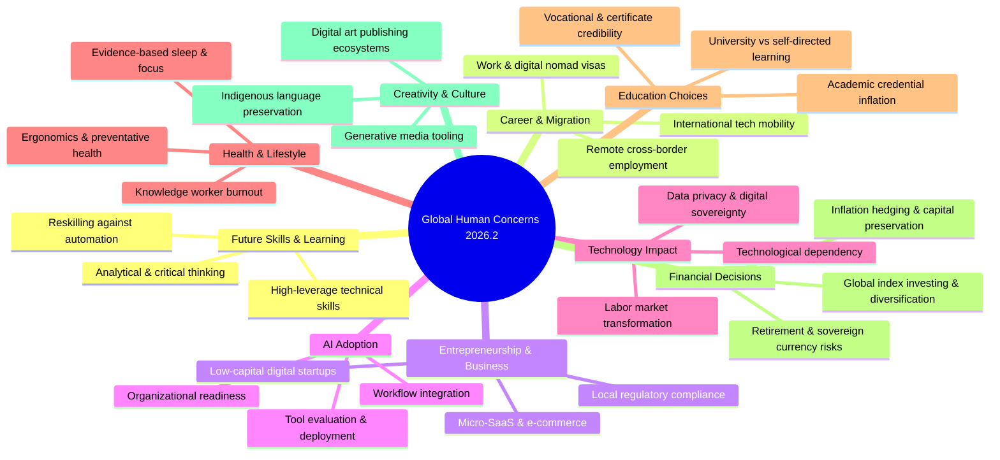
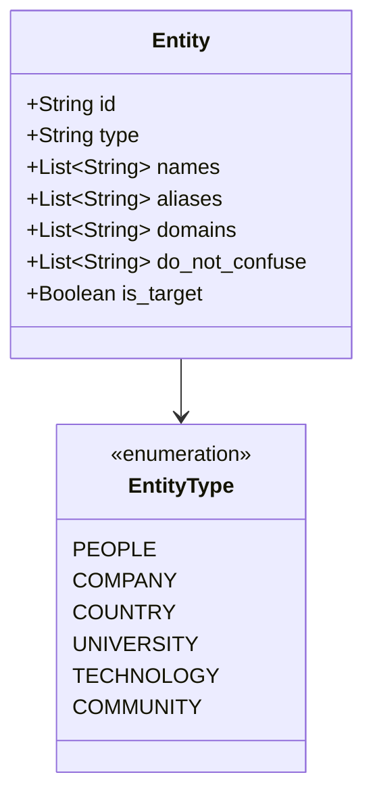
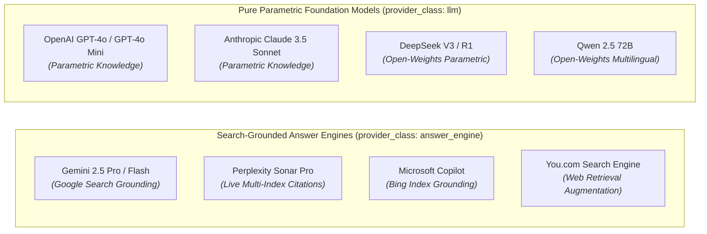

# GEO-Scope Global Human Concerns Benchmark 2026.2
## Research Protocol & System Architecture Design Specification

**Document Version**: `1.0.0-draft`  
**Planned Dataset Release ID**: `global-ai-answers-2026.2`  
**Measurement Framework**: [GEO-Scope](https://github.com/tmolavi/geo-scope)  
**Discovery Lineage**: AnswerPath GEO  
**Execution Gateway**: Hamzad AI Gateway (`https://api.molavi.pro`)  
**Design Principle**: *Scientific Credibility > Dataset Volume. Empirical Observations > Normative Rankings.*

---

## 1. Executive Summary & Epistemic Guardrails

The **Global Human Concerns Benchmark 2026.2** expands upon the initial `2026.1` foundation to systematically investigate:
> *"How do leading generative AI answer engines and large language models answer essential human dilemmas when queried across diverse cultural, linguistic, and socioeconomic contexts?"*

### Core Anti-Hype & Scientific Guardrails
1. **Zero Human or Entity Rankings**: The benchmark **does not rank humanity**, designate the "best person", identify the "smartest nation", or select a "winning brand".
2. **Empirical Distribution Recording**: Metrics represent strictly observed token spans, source citations, and recommendation frequencies across specified model API checkpoints.
3. **No Algorithm Reverse-Engineering Claims**: We record observed black-box outputs under specified prompts; no claims are made regarding proprietary weights, ranking algorithm formulas, or internal training data proportions.
4. **Cultural Localization over Machine Translation**: Prompts must reflect authentic regional realities (e.g. local bureaucratic hurdles, domestic currency dynamics, hyper-local education systems) rather than robotic word-for-word translation.

---

## 2. Research Taxonomies & Concern Stratification

The 2026.2 benchmark protocol organizes human inquiries across **9 distinct concern domains**:



### 2.1 Detailed Domain Matrix
| Domain ID | Category Name | Core Research Focus | Example Intent Stratum |
| :--- | :--- | :--- | :--- |
| `CAT-01` | **Future Skills & Learning** | Adaptability, high-value programming languages, ML, data literacy | Skill acquisition roadmap |
| `CAT-02` | **Career & Migration** | Global talent attraction, point-based immigration, remote hiring hubs | Relocation & visa feasibility |
| `CAT-03` | **Entrepreneurship & Business** | Micro-SaaS, digital agency models, low-overhead online ventures | Startup bootstrapping |
| `CAT-04` | **Artificial Intelligence Adoption** | Enterprise generative AI tools, localized LLMs, productivity | Toolchain selection |
| `CAT-05` | **Technology Impact** | Automation effects, surveillance, open-source software sovereignty | Socio-technical evaluation |
| `CAT-06` | **Health & Lifestyle** | Burnout prevention, cognitive endurance, evidence-based wellness | Health maintenance protocol |
| `CAT-07` | **Education Choices** | ROI of traditional degrees vs. coding bootcamps & open courseware | Institutional vs. self-study |
| `CAT-08` | **Financial Decisions** | Long-term asset allocation, inflation defense, decentralized assets | Wealth preservation |
| `CAT-09` | **Creativity & Culture** | Digital authoring, regional arts, multimedia workflow automation | Creative tooling & publishing |

---

## 3. Geographic & Linguistic Coverage: 50 Country Matrix

The sampling framework covers **50 countries** across **6 continental macro-regions**, evaluated in **20+ native languages**:

```
├── Middle East & North Africa (8)
│   ├── Iran (fa), Saudi Arabia (ar), UAE (ar/en), Egypt (ar), Turkey (tr), Israel (he), Morocco (ar/fr), Qatar (ar)
├── North America (3)
│   ├── United States (en), Canada (en/fr), Mexico (es)
├── Europe (14)
│   ├── Germany (de), United Kingdom (en), France (fr), Italy (it), Spain (es), Netherlands (nl),
│   ├── Sweden (sv), Switzerland (de/fr), Poland (pl), Ukraine (uk), Ireland (en), Portugal (pt),
│   ├── Austria (de), Norway (no)
├── Asia & Pacific (15)
│   ├── Japan (ja), China (zh), India (hi/en), South Korea (ko), Singapore (en), Indonesia (id),
│   ├── Vietnam (vi), Australia (en), New Zealand (en), Taiwan (zh), Malaysia (ms/en),
│   ├── Thailand (th), Philippines (en/tl), Pakistan (ur/en), Bangladesh (bn)
├── Latin America (6)
│   ├── Brazil (pt), Argentina (es), Colombia (es), Chile (es), Peru (es), Costa Rica (es)
└── Sub-Saharan Africa (4)
    ├── Nigeria (en), South Africa (en), Kenya (en/sw), Ghana (en)
```

---

## 4. Question Matrix & Prompt Schema (500 Prompts Target)

### 4.1 Stratification Rules
- **Prompt Partitioning**:
  - `observed_user_questions` (60%): Real user queries harvested and anonymized via AnswerPath GEO intent clusters.
  - `research_questions` (40%): Controlled, counterfactual inquiry templates designed to test comparative regional responses.
- **Cultural Adaptation Guardrails**:
  - Non-literal phrasing capturing regional institutions (e.g. BaFin in Germany, CPF in Singapore, SAT in Mexico).
  - Explicit documentation of the underlying cultural dilemma in `cultural_context`.

### 4.2 Standard Prompt JSONL Record Schema
```json
{
  "id": "gaa-2026-2-c02-de-042",
  "source_category": "observed_user_questions",
  "category": "career_migration",
  "intent": "recommendation",
  "language": "de",
  "region": "europe",
  "country_iso": "DEU",
  "country_name": "Germany",
  "prompt_text": "Welche Visabestimmungen und Gehaltskriterien gelten für außereuropäische Software-Architekten im Rahmen der Chancenkarte 2026?",
  "cultural_context": "Reflects Germany's 2026 Skilled Immigration Act (Chancenkarte/Opportunity Card) points system and EU Blue Card salary thresholds for non-EU specialists.",
  "disambiguation_hints": ["Chancenkarte", "Fachkräfteeinwanderungsgesetz", "EU Blue Card"]
}
```

---

## 5. Multi-Type Entity Tracking & Disambiguation Model

To ensure scientific precision, entities are modeled with strict categorization, alias registers, and negative homonym exclusion rules (`do_not_confuse`).



### 5.1 Supported Entity Classifications (6 Types)
1. `people`: Public figures, domain scientists, researchers (tracked purely for citation/mention frequency, never for merit scoring).
2. `companies`: Cloud providers, software vendors, AI labs, enterprise corporations.
3. `countries`: Sovereign nations, relocation destinations, legal jurisdictions.
4. `universities`: Academic institutions, higher-education research centers.
5. `technologies`: Programming languages, frameworks, open-source models, software protocols.
6. `communities`: Developer platforms, open research consortiums, educational communities.

### 5.2 Standard Entity JSON Schema
```json
{
  "id": "pytorch",
  "type": "technology",
  "names": ["PyTorch", "پای‌تورچ", "パイトーチ"],
  "aliases": ["torch", "pytorch.org"],
  "domains": ["pytorch.org", "github.com/pytorch/pytorch"],
  "do_not_confuse": ["flashlight torch", "welding torch", "blowtorch"],
  "is_target": false
}
```

---

## 6. Model Provider Matrix & Grounding Separation

To decouple live web retrieval grounding effects from parametric knowledge, the provider matrix strictly segregates models into two architectural classes:



---

## 7. Empirical Measurement Metrics & Uncertainty Formulation

All metric calculations are strictly descriptive and non-normative:

### 7.1 Core Metric Definitions
- **Observed Mention Rate ($\text{MR}$)**:
  $$\text{MR}(e) = \frac{1}{N} \sum_{i=1}^{N} \mathbb{I}(e \in \text{ObservedTokens}(R_i))$$
- **Explicit Recommendation Rate ($\text{RR}$)**:
  $$\text{RR}(e) = \frac{1}{N} \sum_{i=1}^{N} \mathbb{I}(e \text{ surfaced in recommendation context in } R_i)$$
- **Source Citation Rate ($\text{CR}$)**:
  $$\text{CR}(e) = \frac{1}{N} \sum_{i=1}^{N} \mathbb{I}(\text{Citations}(R_i) \cap \text{Domains}(e) \neq \emptyset)$$
- **Top-1 Position Rate ($\text{Top1}$)**:
  $$\text{Top1}(e) = \frac{1}{N} \sum_{i=1}^{N} \mathbb{I}(\text{first\_entity}(R_i) == e)$$
- **Epistemic Uncertainty Index ($\text{UI}$)**:
  $$\text{UI}(R_i) = \frac{\text{Count}(\text{Hedge Words: 'may', 'perhaps', 'depends', 'unclear'})}{\text{Total Tokens}(R_i)}$$

---

## 8. Dataset Release Bundle Specification (`global-ai-answers-2026.2`)

The final release will follow the immutable directory layout:

```
benchmark/releases/global-ai-answers-2026.2/
├── manifest.json              # Version metadata, lineage, model matrix, and file inventory
├── prompts.jsonl              # 500 culturally localized prompt records
├── prompts/
│   ├── global.jsonl           # Cross-regional baseline queries
│   ├── regional.jsonl         # Region-specific inquiries (50 countries)
│   ├── observed.jsonl         # Mined real user questions
│   └── research.jsonl         # Controlled counterfactual templates
├── entities.json              # Multi-type entity catalog with aliases & do_not_confuse rules
├── raw_responses.jsonl        # Byte-for-byte unparsed model outputs (latency, HTTP codes, token stats)
├── observations.jsonl         # Deterministically parsed entity observations & sentiment context
├── citations.jsonl            # Extracted web source URLs and publisher domain metadata
├── metrics.json               # Aggregated distributions by category, region, language, and provider
├── errors.jsonl               # Transparent log of provider timeouts and transient failures
├── checksums.sha256           # Cryptographic SHA-256 signatures for every file in the package
├── methodology.md             # Complete scientific and statistical documentation
└── limitations.md             # Sampling boundaries, temporal constraints, and epistemic guardrails
```

---

## 9. Next Steps for Execution Phase
1. Complete prompt authoring and cultural review across target regional linguists.
2. Expand entity registry in `entities/global-entities-2026.json`.
3. Run pre-flight provider validation via `geo-scope benchmark providers-check`.
4. Execute full benchmark run using the Hamzad AI Gateway cluster.
5. Validate package with `geo-scope benchmark validate --dataset benchmark/releases/global-ai-answers-2026.2`.
