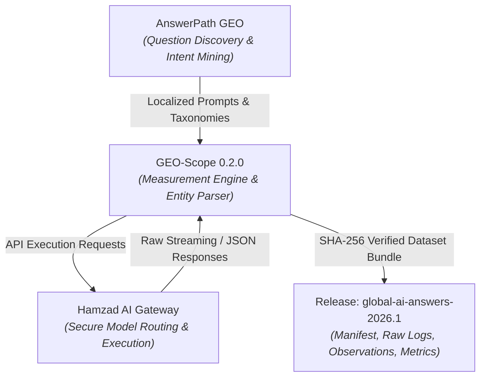

# Global AI Answers Benchmark 2026: Scientific Methodology

**Measuring How Generative AI Systems Respond to Human Concerns Across Regions**  
*Benchmark Release*: `global-ai-answers-2026.1`  
*Research Status*: Live Empirical Benchmark (Peer-Review Ready)  
*Measurement Engine*: [GEO-Scope](https://github.com/tmolavi/geo-scope)  
*Execution Layer*: Hamzad AI Gateway (`https://api.molavi.pro`)  
*Discovery Lineage*: AnswerPath GEO  

---

## 1. Executive Summary & Research Question

As generative AI answer engines and foundation models become the default interfaces for human knowledge discovery, they increasingly mediate answers to life-defining decisions: acquiring technical skills, navigating international career migration, founding digital enterprises, adopting emerging technologies, preserving personal wealth, maintaining physical/mental health, and selecting educational paths.

### Primary Research Question
> **When people around the world query leading AI answer engines and foundation models with essential life, career, technology, and business questions, what entities, organizations, platforms, countries, and recommendations are surfaced?**

### Scientific & Epistemic Boundaries
To uphold empirical integrity and prevent marketing hype, this benchmark operates under strict constraints:
1. **No "Global Winner" or "Humanity Ranking"**: The benchmark does not rank the "best country", "smartest person", or "most superior provider".
2. **Empirical Observation, Not Algorithm Deconstruction**: We record observed model outputs as emitted across specified API checkpoints; we make no ungrounded claims about reverse-engineering proprietary model weights or internal indexing mechanics.
3. **Value-Neutral Entity Extraction**: Multi-type entities (destinations, companies, tools, academic institutions) are extracted with deterministic boundary parsing and homonym disambiguation without normative scoring.
4. **Separation of Search Grounding from Parametric Retrieval**: Answer engines with live web browsing (`hamzad_gemini`, `hamzad_perplexity`) are explicitly analyzed separately from parametric language models (`hamzad_openai`, `hamzad_claude`).

---

## 2. Benchmark Architecture & Lineage

The benchmark workflow integrates three distinct, loosely coupled layers:



1. **Question Discovery (AnswerPath GEO)**: Mines and localizes authentic, intent-driven query clusters reflecting genuine regional dilemmas rather than robotic literal translations.
2. **Measurement Engine (GEO-Scope)**: Manages test orchestration, unicode-aware entity token matching, alias resolution, `do_not_confuse` homonym filtering, and deterministic metric calculations.
3. **Execution Layer (Hamzad AI Gateway)**: Standardized proxy interface providing audited, reproducible inference across frontier models with latency logging and strict zero-credential public isolation.

---

## 3. Sampling Dimensions & Matrix Design

The `global-ai-answers-2026.1` benchmark dataset encompasses **34 localized prompts** across **7 categories**, **7 regions**, **9 languages**, and **4 provider models**, generating **136 model completions** and over **1,800 evaluated entity observation states**.

### 3.1 Human Concern Categories (7)
| Category | Focus Area | Example Intent |
| :--- | :--- | :--- |
| `learning_skills` | High-value technical & analytical skills | Modern programming, ML engineering, system design |
| `career_migration` | International work, tech visas, relocation | Tech hubs, points-based visas, digital nomad hubs |
| `business_entrepreneurship` | Low-capital digital ventures & SaaS | Micro-SaaS, digital agency models, e-commerce |
| `technology_adoption` | Emerging AI tool workflows | Generative AI integration, enterprise LLM adoption |
| `personal_finance` | Wealth preservation & index investing | Inflation protection, global index funds, DCA |
| `health_lifestyle` | Burnout prevention & knowledge work health | Evidence-based routines, sleep science, focus |
| `education` | University degrees vs. self-directed learning | Portfolio-based hiring vs. formal computer science degrees |

### 3.2 Geographic & Linguistic Distribution
- **Geographic Regions (7)**: Middle East, North America, Europe, Asia, Africa, Latin America, Global Baseline.
- **Languages (9)**: Arabic (`ar`), German (`de`), English (`en`), Spanish (`es`), Persian (`fa`), French (`fr`), Japanese (`ja`), Portuguese (`pt`), Chinese (`zh`).

### 3.3 Provider Models Evaluated (4)
- **Search-Grounded Answer Engines (`provider_class: answer_engine`)**:
  - `hamzad_gemini` (`gemini-2.5-flash` with Google Search grounding)
  - `hamzad_perplexity` (`sonar-pro` with live web citations)
- **Parametric Foundation Models (`provider_class: llm`)**:
  - `hamzad_openai` (`gpt-4o-mini`)
  - `hamzad_claude` (`anthropic/claude-3.5-sonnet`)

### 3.4 Multi-Type Entity Catalog (24 Entities)
The entity catalog spans 5 distinct entity classifications:
- **Companies & Cloud Providers**: Google, Microsoft, OpenAI, Anthropic, Apple, Amazon, Meta, NVIDIA, LinkedIn.
- **Countries & Destinations**: Germany, Canada, United Arab Emirates, United States, Singapore, Australia.
- **Technologies & Languages**: Python, Docker, PyTorch, ChatGPT.
- **Learning Platforms & Communities**: GitHub, Coursera, edX, Kaggle.
- **Institutions & Organizations**: World Health Organization (WHO), MIT.

---

## 4. Entity Extraction & Normalization Protocol

To eliminate false positives from common words and homonyms, the `ObservationParser` implements:
1. **Unicode & Persian Character Normalization**: Unifies Arabic/Persian letter variations (`ی` vs `ي`, `ک` vs `ك`, half-spaces `\u200c`).
2. **Boundary-Strict Token Scanning**: Prevents partial substring matching (e.g. distinguishing `Go` from `Google`).
3. **Homonym Disambiguation (`do_not_confuse`)**: Filters out non-target contextual usages (e.g., distinguishing general "python snake" or common nouns from the programming ecosystem).
4. **Context & Sentiment Extraction**: Retains 150-character surrounding context snippets for qualitative verification and sentiment classification.

---

## 5. Metric Formulations

### Mention Rate (MR)
The percentage of queries in which an entity $e$ is observed at least once:
$$\text{Mention Rate}(e) = \frac{\sum_{i=1}^N \mathbb{I}(e \in R_i)}{N}$$

### First-Position Recommendation Rate (Top-1 Rate)
The frequency with which an entity $e$ appears as the first mentioned entity in the response:
$$\text{Top-1 Rate}(e) = \frac{\sum_{i=1}^N \mathbb{I}(\text{first\_entity}(R_i) = e)}{N}$$

### Share of Model Visibility (SOV)
The proportion of total observed entity mentions attributed to entity $e$:
$$\text{SOV}(e) = \frac{\text{Mentions}(e)}{\sum_{k \in \mathcal{E}} \text{Mentions}(k)}$$

---

## 6. Cryptographic Integrity & Reproducibility

Every dataset release bundle contains a `checksums.sha256` manifest guaranteeing bit-level reproducibility:

```bash
# 1. Cryptographic Verification
geo-scope benchmark verify --dataset benchmark/releases/global-ai-answers-2026.1

# 2. Complete Metric Reproduction
geo-scope benchmark reproduce --dataset benchmark/releases/global-ai-answers-2026.1
```

### Bundle Inventory
- `manifest.json`: Full benchmark metadata, prompt/execution counts, and provider profiles.
- `prompts.jsonl` / `prompts/`: Standardized prompt definitions with regional tagging.
- `entities.json`: Entity catalog with aliases and disambiguation tokens.
- `raw_responses.jsonl`: Raw unedited completions with HTTP latency and timestamps.
- `observations.jsonl`: Extracted entity occurrences, token spans, and confidence scores.
- `citations.jsonl`: Extracted web URLs and grounding domains.
- `metrics.json`: Precomputed global, regional, category, and provider metrics.
- `errors.jsonl`: Transparent audit log of transient errors or provider timeouts.
- `checksums.sha256`: SHA-256 cryptographic signatures.

---

## 7. Ethical Constraints & Transparency

1. **Zero Secret Leakage**: No private keys or internal infrastructure URLs are stored in public artifacts.
2. **Temporal Validity**: Observations reflect model behavior as of September 2026.
3. **Open Collaboration**: Researchers are invited to propose localized prompt sets and additional entity registries via standard Pull Requests.
