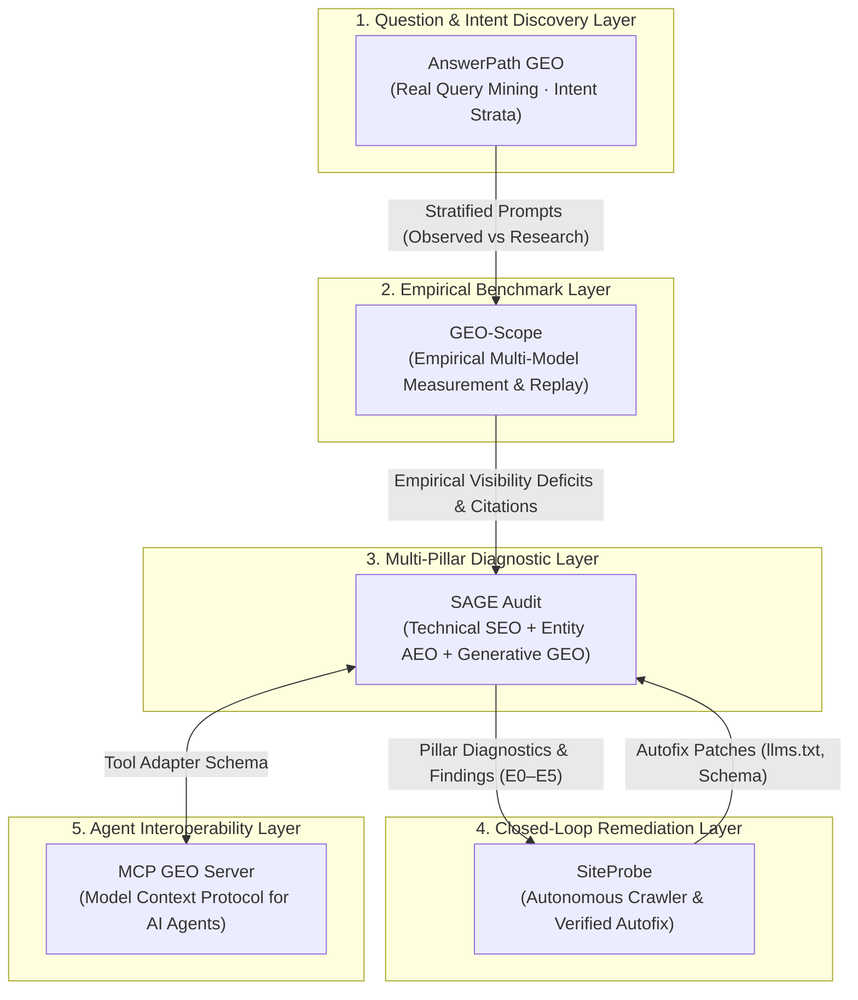

# Molavi AI Visibility & Agent Engineering Ecosystem

Welcome to the central documentation index, methodology hub, and evidence architecture map for the open-source **AI Visibility & Agent Engineering Stack**.

This ecosystem provides empirical measurement, diagnostic auditing, and autonomous closed-loop remediation for Generative Engine Optimization (GEO), Answer Engine Optimization (AEO), and Agent Systems.

---

## 🏛️ Ecosystem Repositories (Tier 1 Stack)

| Repository | Role & Purpose | Public Demo / Release | Reproduction Command |
|---|---|---|---|
| [**geo-scope**](https://github.com/tmolavi/geo-scope) | Empirical Generative AI visibility benchmark engine with bootstrap confidence intervals, zero silent fallback, and replay reproducibility. | [`benchmark/releases/`](https://github.com/tmolavi/geo-scope/tree/main/benchmark/releases/) | `geo-scope benchmark verify --dataset benchmark/releases/global-ai-answers-2026.2` |
| [**answerpath-geo**](https://github.com/tmolavi/answerpath-geo) | Question discovery, search query clustering, and epistemic prompt provenance layer (observed user questions vs research templates). | [`examples/public_demo`](https://github.com/tmolavi/answerpath-geo/tree/main/examples/public_demo) | `python examples/public_demo/run_demo.py` |
| [**sage-audit**](https://github.com/tmolavi/sage-audit) | 3-pillar diagnostic auditing engine (Technical SEO, Entity AEO, Generative GEO) with explicit evidence tagging (E0–E5). | [`examples/public_demo`](https://github.com/tmolavi/sage-audit/tree/main/examples/public_demo) | `python examples/public_demo/run_demo.py` |
| [**siteprobe**](https://github.com/tmolavi/siteprobe) | Closed-loop autonomous auditor & safe autofixer for modern websites (`llms.txt`, JSON-LD, robots.txt). | [`examples/public_demo`](https://github.com/tmolavi/siteprobe/tree/main/examples/public_demo) | `python examples/public_demo/run_demo.py` |
| [**mcp-geo-server**](https://github.com/tmolavi/mcp-geo-server) | Model Context Protocol server exposing multi-pillar diagnostic tools to AI coding agents (Claude Code, Cursor, Antigravity). | [`examples/public_demo`](https://github.com/tmolavi/mcp-geo-server/tree/main/examples/public_demo) | `python examples/public_demo/run_demo.py` |

---

## 🔬 Scientific & Epistemic Principles

1. **Empirical Measurement**: No claims of "guaranteed rankings" or "reverse-engineered algorithms." All metrics reflect observed empirical distributions across categorized prompt cohorts.
2. **Deterministic Reproducibility**: All benchmark datasets publish SHA-256 cryptographic checksums (`checksums.sha256`), raw API completions (`raw_responses.jsonl`), and granular observations (`observations.jsonl`).
3. **Zero Silent Fallback**: Live measurements never mask API timeouts or failures with synthetic simulation fixtures. Failures are transparently logged to `errors.jsonl`.
4. **Provider Class Separation**: Search-grounded **Answer Engines** (`perplexity_sonar`, `gemini_grounding`) and parametric **LLMs** (`gpt_4o`, `claude_35_sonnet`) are measured and reported as distinct metric families.
5. **Epistemic Classification**: Every diagnostic finding is tagged with an evidence taxonomy level (E0–E5) indicating the strength of the underlying technical standard.

---

## 📊 Published Research Benchmark Packages

GEO-Scope maintains immutable, versioned benchmark releases with full raw evidence:

1. **Global AI Answers Benchmark 2026.2 (Full Research Release)**:
   - Package: [`benchmark/releases/global-ai-answers-2026.2/`](https://github.com/tmolavi/geo-scope/tree/main/benchmark/releases/global-ai-answers-2026.2/)
   - Scope: 500 prompts across 50 countries, 22+ languages, 9 concern categories, 73 entities, 626 raw completions.
   - [Academic Paper Draft](research/global-ai-answers-2026.2/global-ai-answers-paper.md) · [Executive Report](research/global-ai-answers-2026.2/global-ai-answers-report.md) · [Article Angles](research/global-ai-answers-2026.2/article-ideas.md)
   - Verify: `geo-scope benchmark verify --dataset benchmark/releases/global-ai-answers-2026.2`
   - Replay: `geo-scope benchmark replay --dataset benchmark/releases/global-ai-answers-2026.2`

2. **Global AI Answers Benchmark 2026.2 Pilot**:
   - Package: [`benchmark/releases/global-ai-answers-2026.2-pilot/`](https://github.com/tmolavi/geo-scope/tree/main/benchmark/releases/global-ai-answers-2026.2-pilot/)
   - Scope: 100 prompts across 10 representative countries, 8 languages, 30 entities, 298 raw completions.
   - [Pilot Report](GLOBAL_AI_ANSWERS_2026_2_PILOT_REPORT.md) · [Roadmap](ROADMAP_GLOBAL_AI_ANSWERS_2026_2.md)
   - Verify: `geo-scope benchmark verify --dataset benchmark/releases/global-ai-answers-2026.2-pilot`
   - Replay: `geo-scope benchmark replay --dataset benchmark/releases/global-ai-answers-2026.2-pilot`

3. **Global AI Answers Benchmark 2026.1**:
   - Package: [`benchmark/releases/global-ai-answers-2026.1/`](https://github.com/tmolavi/geo-scope/tree/main/benchmark/releases/global-ai-answers-2026.1/)
   - Scope: 34 prompts across 7 regions, 9 languages, 24 entities.
   - [Methodology](global-ai-answers-methodology.md) · [Limitations](global-ai-answers-limitations.md) · [Reproduction Guide](REPRODUCE_GLOBAL_AI_ANSWERS.md)
   - Verify: `geo-scope benchmark verify --dataset benchmark/releases/global-ai-answers-2026.1`
   - Replay: `geo-scope benchmark replay --dataset benchmark/releases/global-ai-answers-2026.1`

4. **GEO & SEO Digital Agency Iran Benchmark 2026.1**:
   - Package: [`benchmark/releases/geo-seo-digital-agency-iran-2026.1/`](https://github.com/tmolavi/geo-scope/tree/main/benchmark/releases/geo-seo-digital-agency-iran-2026.1/)
   - Scope: 30 prompts across 5 intent strata, 8 agencies, 120 completions.
   - [Full Report](../benchmarks/geo-seo-digital-agency-iran-2026.1/report.md) · [Case Study](case-studies/geo-seo-digital-agency-iran-2026.md)
   - Verify: `geo-scope benchmark verify --dataset benchmark/releases/geo-seo-digital-agency-iran-2026.1`
   - Reproduce: `geo-scope benchmark reproduce --dataset benchmark/releases/geo-seo-digital-agency-iran-2026.1`

---

## 📚 Core Documentation & Guides

- [Cross-Repository Evidence Map](EVIDENCE_MAP.md)
- [Empirical Benchmark Methodology](benchmark-methodology.md)
- [Research Transparency & Limitations](research-transparency.md)
- [Client & Agent Integrations](CLIENT_INTEGRATIONS.md)
- [Live API Setup & Configuration](API_INTEGRATION.md)
- [Mathematical Model & Formulations](MATHEMATICAL_MODEL.md)
- [External Research Review Checklist](EXTERNAL_RESEARCH_REVIEW.md)
- [Benchmark Versioning Guidelines](BENCHMARK_VERSIONING.md)
- [Farsi Detailed Guide (راهنمای فارسی)](FA_GUIDE.md)
