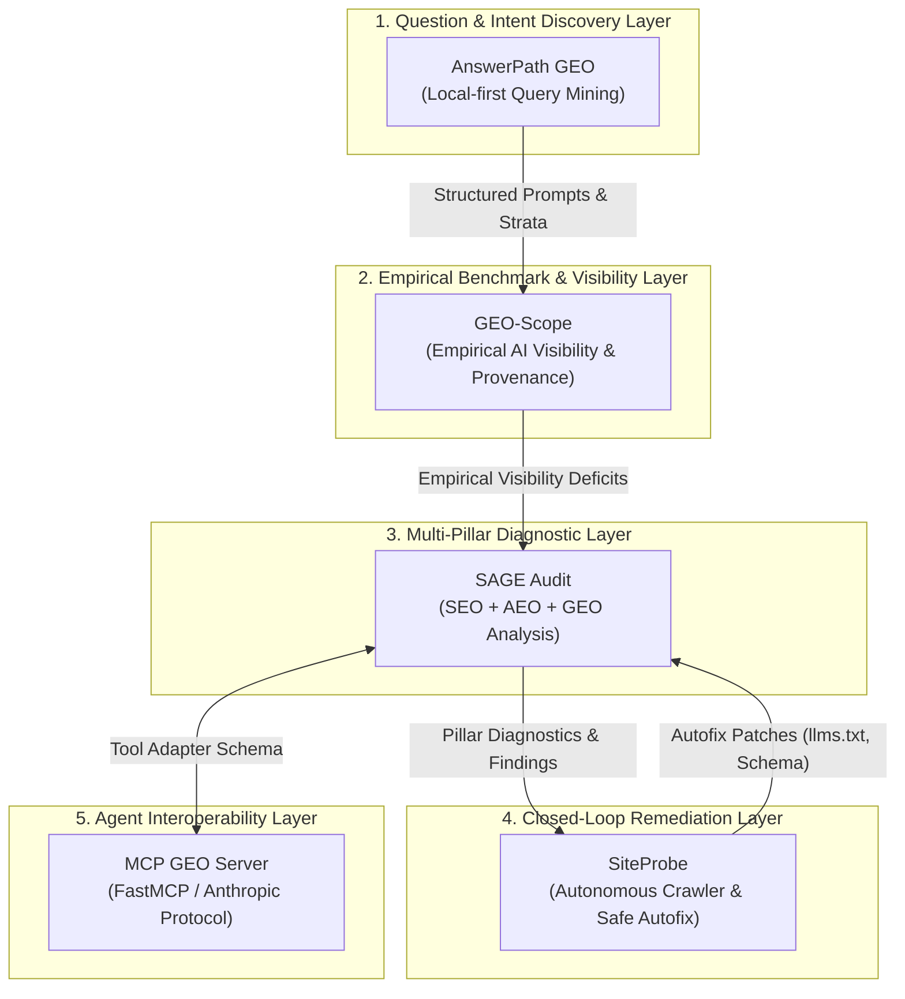

# Molavi AI Visibility & Agent Engineering Ecosystem

Welcome to the central documentation index and architecture map for the open-source **AI Visibility & Agent Engineering Stack**.

This ecosystem provides empirical measurement, diagnostic auditing, and autonomous closed-loop remediation for Generative Engine Optimization (GEO), Answer Engine Optimization (AEO), and Agent Systems.

---

## 🏛️ Ecosystem Repositories (Tier 1 Stack)

| Repository | Role & Purpose | Public Demo | Primary Command |
|---|---|---|---|
| [**geo-scope**](https://github.com/tmolavi/geo-scope) | Empirical Generative AI visibility benchmark engine with bootstrap confidence intervals & fallback provenance tracking. | [`examples/public_demo`](https://github.com/tmolavi/geo-scope/tree/main/examples/public_demo) | `geo-scope benchmark reproduce --dataset examples/public_demo` |
| [**answerpath-geo**](https://github.com/tmolavi/answerpath-geo) | Question discovery, search query clustering, and epistemic prompt provenance layer (observed vs generated). | [`examples/public_demo`](https://github.com/tmolavi/answerpath-geo/tree/main/examples/public_demo) | `python examples/public_demo/run_demo.py` |
| [**sage-audit**](https://github.com/tmolavi/sage-audit) | 3-pillar diagnostic auditing engine (Technical SEO, Entity AEO, Generative GEO) with explicit evidence tagging. | [`examples/public_demo`](https://github.com/tmolavi/sage-audit/tree/main/examples/public_demo) | `python examples/public_demo/run_demo.py` |
| [**siteprobe**](https://github.com/tmolavi/siteprobe) | Closed-loop autonomous auditor & safe autofixer for modern websites (`llms.txt`, JSON-LD, robots.txt). | [`examples/public_demo`](https://github.com/tmolavi/siteprobe/tree/main/examples/public_demo) | `python examples/public_demo/run_demo.py` |
| [**mcp-geo-server**](https://github.com/tmolavi/mcp-geo-server) | Model Context Protocol server exposing multi-pillar diagnostic tools to AI coding agents (Claude Code, Cursor, Antigravity). | [`examples/public_demo`](https://github.com/tmolavi/mcp-geo-server/tree/main/examples/public_demo) | `python examples/public_demo/run_demo.py` |

---

## 🔬 Scientific & Epistemic Principles

1. **Empirical Measurement**: No claims of "guaranteed rankings" or "reverse-engineered algorithms." All metrics reflect observed distributions across empirical prompt samples.
2. **Deterministic Reproducibility**: All benchmark datasets publish SHA-256 cryptographic checksums (`checksums.sha256`) and full raw execution logs (`observations.jsonl`).
3. **Provenance Integrity**: Clear separation between native provider executions and router fallbacks (`execution_class: native | fallback`).
4. **Epistemic Classification**: Every diagnostic finding is tagged with an evidence taxonomy level (E0–E4) indicating the strength of the underlying technical standard.

---

## 📚 Ecosystem Documentation Hub

- [Ecosystem Architecture & Data Contracts](GITHUB_ECOSYSTEM.md)
- [Empirical Benchmark Methodology](benchmark-methodology.md)
- [Public Proof Roadmap & Reproducibility Matrix](PUBLIC_PROOF_ROADMAP.md)
- [Public Proof Execution & Verification Report](PUBLIC_PROOF_REPORT.md)
- [GitHub Adoption Readiness Report](GITHUB_ADOPTION_REPORT.md)
